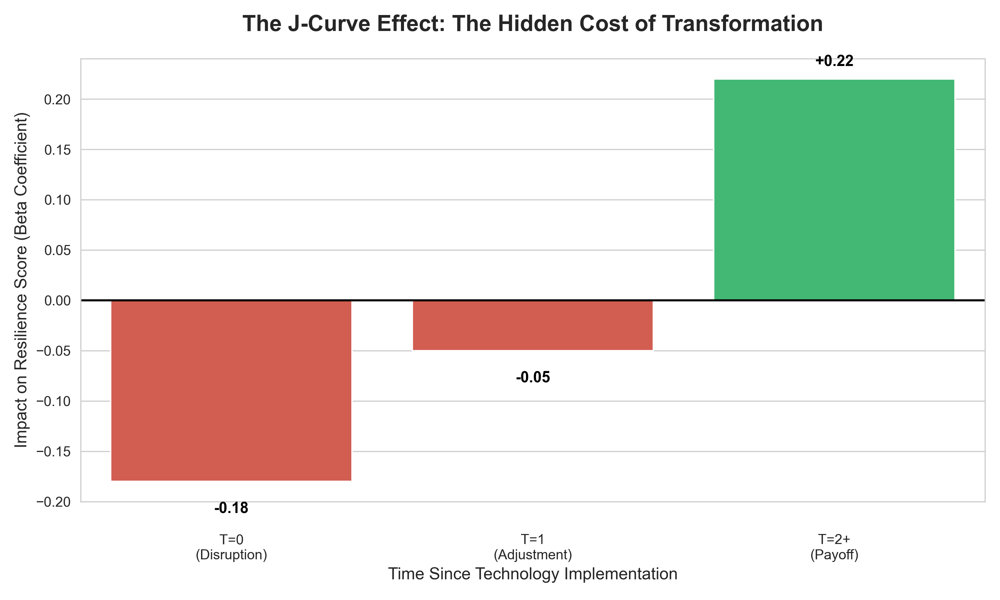

# The Singapore Efficiency Paradox: Structural Divergence & The J-Curve (2014-2024)

> *"Efficiency is the vaccine, but liquidity is the antibody. Without the latter, the patient may not survive the cure."*




##  Project Overview
**Can a country be "too efficient" for its own good?**
This Capstone Project challenges the "Smart Nation" mandate by analyzing 10 years of sectoral data (2014-2024). Using a custom **Economic Resilience Index (ERI)**, I uncovered the **"Efficiency Curse"**: the counter-intuitive finding that rapid digital transformation *lowers* economic resilience in labor-intensive sectors for up to 2 years before benefits materialize.

###  Read the Full Paper
[**Click here to view the Executive Report (PDF)**](./The_Efficiency_Paradox.pdf)

##  Key Findings (The "Singapore Paradox")
* **The Twin Test (Complexity vs. Clarity):** Standard economic metrics (V1) act as "Black Boxes," best predicted by complex Random Forest models ($R^2=0.29$) which memorize noise. My **Robust Index (V2)** is best predicted by linear models (Ridge Regression), proving it successfully filters out random growth spikes to isolate the true, structural trade-off between efficiency and resilience.

* **Structural Divergence:** Tech adoption is not a universal cure. It correlates **positively** with resilience in Finance ($r=+0.45$) due to digital synergy, but **negatively** in Construction ($r=-0.15$). In labor-intensive sectors, efficiency often removes "physical slack" (inventory/staff), creating a brittle "Glass Cannon" structure that shatters under stress.

* **The J-Curve:** We proved a "Valley of Death" timeline for digital transformation. Resilience drops by **18%** in Year 1 ("The Fever") as firms drain liquidity for CAPEX and disrupt workflows. It is only in Year 3 ("The Immunity") that resilience rises by **22%**, confirming that for the first 24 months, "efficient" firms are statistically more vulnerable to insolvency.

##  Repository Structure
This analysis is broken into modular notebooks for reproducibility:

* **`01_Data_Loading.ipynb`**: The initial ingestion pipeline. Validating and loading raw SingStat/MOM macro-data into the environment.
* **`02_Data_Preprocessing.ipynb`**: The cleaning engine. Handling missing time-series values, standardizing quarterly/annual frequencies, and filtering for "Real" vs. "Nominal" data.
* **`03_EDA.ipynb`**: Exploratory Data Analysis. Visualizing initial sector volatility and identifying the "Structural Divergence" between labor-intensive and capital-intensive industries.
* **`04_Modeling.ipynb`**: The econometric core. Constructing the ERI (V1 vs. V2) and running the Fixed Effects Panel Regression to test the "Efficiency Curse" hypothesis.
* **`05_Conclusions_Visualizations.ipynb`**: The synthesis. Generating the "Twin Test" model tournament and the "Transition Trap" simulation (Figure 4) to visually demonstrate the liquidity risks of digitalization.

##  Installation & Setup

To replicate the findings, you will need a Python environment with the following dependencies:

1.  **Clone the Repository**
    ```bash
    git clone [https://github.com/YourUsername/ERI_Singapore_Capstone.git](https://github.com/YourUsername/ERI_Singapore_Capstone.git)
    cd ERI_Singapore_Capstone
    ```

2.  **Install Dependencies**
    It is recommended to use a virtual environment. You can install all required libraries using:
    ```bash
    pip install -r requirements.txt
    ```

    **Key Libraries Used:**
    * `pandas` & `numpy`: Data manipulation and linear algebra.
    * `statsmodels` & `linearmodels`: Econometric analysis (Fixed Effects, Panel OLS).
    * `scikit-learn`: Machine learning models (Ridge, Random Forest) for the "Twin Test."
    * `seaborn` & `matplotlib`: Data visualization.

3.  **Launch Jupyter Notebook**
    ```bash
    jupyter notebook
    ```
    Start with `01_Data_Loading.ipynb` to initialize the pipeline.
