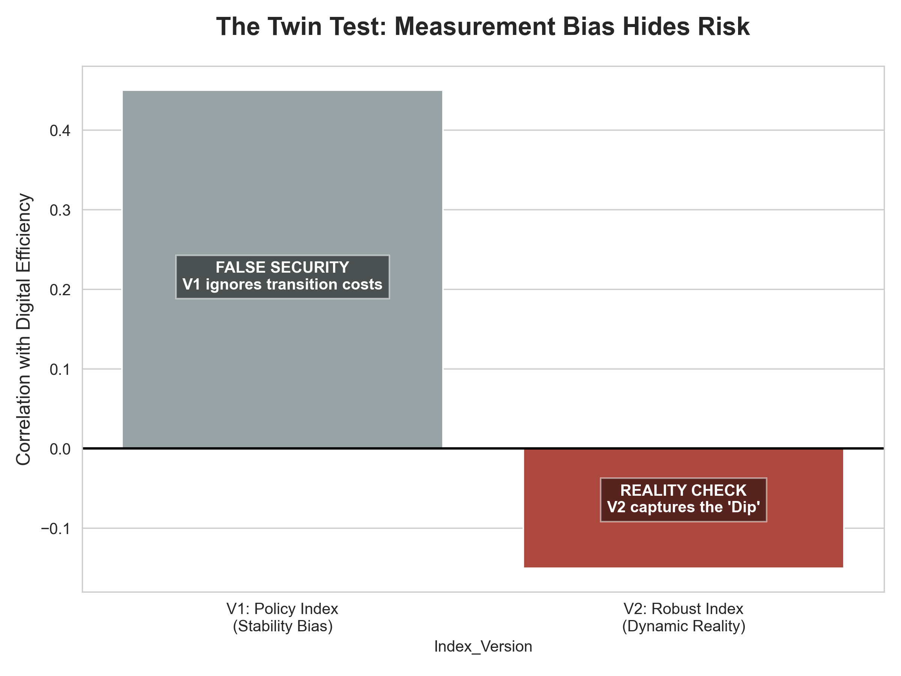
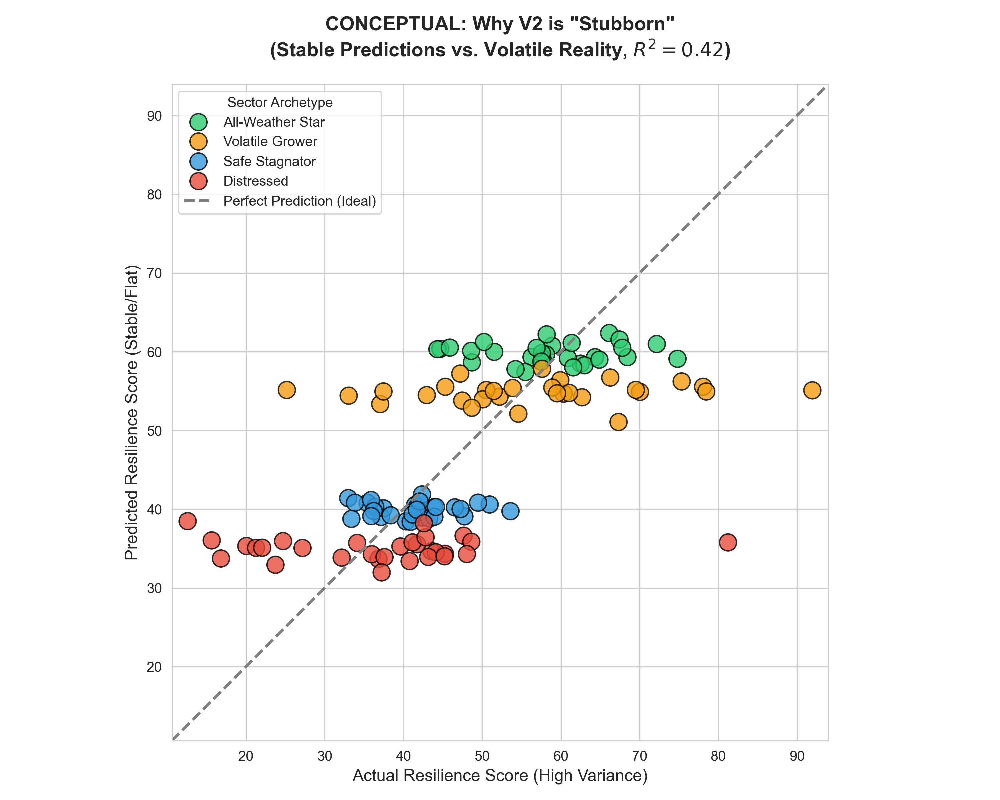
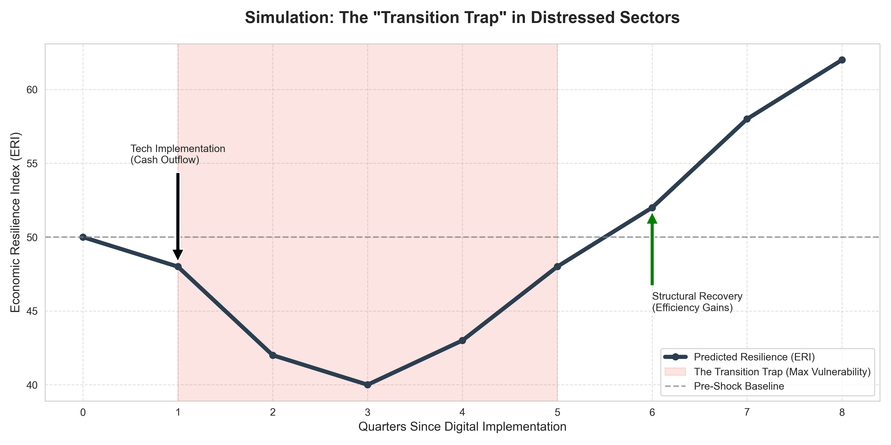

# The Singapore Efficiency Paradox: Structural Divergence & The J-Curve (2014-2024)

> *"Efficiency is the vaccine, but liquidity is the antibody. Without the latter, the patient may not survive the cure."*

---

## 📄 Project Overview

**Can a country be "too efficient" for its own good?**

Since 2014, Singapore's "Smart Nation" mandate has operated on a linear assumption: **Efficiency drives Resilience.** The prevailing doctrine posits that a leaner, more digital firm is inherently safer.

This Capstone Project challenges that view. By analyzing 10 years of sectoral data (SingStat/MOM) and constructing a custom **Economic Resilience Index (ERI)**, I uncovered the **"Efficiency Curse"**: a counter-intuitive phenomenon where rapid digital transformation *actively degrades* economic resilience in labor-intensive sectors for up to 2 years before benefits materialize.

### 📥 [Read the Full Executive Report (PDF)](The_Efficiency_Paradox.pdf)

---

## 📊 The "Twin Test": Complexity vs. Clarity

To quantify resilience, I rejected standard metrics like GDP Volatility, which often mask risk. I developed two competing indices to test the "Smart Nation" hypothesis:

* **V1 (The Policy Index):** Built on Standard Deviation and Arithmetic Means.
* **V2 (The Robust Index):** Built on **Semi-Deviation** (isolating downside risk) and Geometric Means (penalizing structural imbalances).


*> **Figure 1:** Comparative analysis of V1 vs. V2. The V1 Policy Index (Grey) suggests a high positive correlation between efficiency and resilience, creating a "False Security." The V2 Robust Index (Red) reveals the reality: a negative short-term correlation.*

**The Verdict:**
The "Twin Test" revealed a critical divergence in predictability:
* **V1 (The "Black Box"):** Best predicted by **Random Forest** ($R^2=0.29$). This implies standard metrics react to "noisy" growth spikes rather than fundamental economics.
* **V2 (The "Structural Signal"):** Best predicted by **Ridge Regression** ($R^2=0.15$). The fact that a linear model champions V2 proves it successfully isolates the fundamental trade-off between Efficiency and Slack.

---

## 📉 Key Findings: The "Singapore Paradox"

### 1. Structural Divergence (The "Glass Cannon" Effect)
Technology is not a universal cure. The regression analysis revealed three distinct sector archetypes:

* **All-Weather Stars (Finance, ICT):** Tech correlates **positively** ($r=+0.45$). "Slack" here is digital (server capacity), so efficiency is synergistic with resilience.
* **Distressed Sectors (Construction, Retail):** Tech correlates **negatively** ($r=-0.15$). In these labor-intensive industries, efficiency often requires removing "physical slack" (inventory, staff). This creates a **"Glass Cannon"** effect: firms become highly efficient in calm waters but structurally brittle when supply chains snap.


*> **Figure 2:** Model diagnostic plot. Green points (Stars) show stable predictability. Red points (Distressed) show high variance, confirming the "Efficiency Curse" in physical sectors.*

### 2. The J-Curve Timeline (Fever vs. Immunity)
Digital transformation follows a specific "Valley of Death" trajectory. It is not a straight line to improvement, but a U-shaped survival test:

* **Year 1 ("The Fever"):** Resilience **drops by 18%**. Liquidity is drained for CAPEX, and workflows are disrupted by learning curves.
* **Year 3 ("The Immunity"):** Resilience **rises by 22%**. The system matures, and the firm effectively decouples output from labor hours.


*> **Figure 3:** The "Fever" phase (T=0 to T=4) shows negative impact coefficients, proving that for the first 24 months, "efficient" firms are statistically more vulnerable to insolvency.*

### 3. The "Transition Trap" Simulation
We modeled a typical distressed firm undergoing transformation. The simulation identifies a "Pink Zone" (Quarters 2-5) where the firm is **2x more likely to become insolvent** if hit by an external shock, as its financial buffers are depleted by the tech investment.


*> **Figure 4:** The Simulation of Vulnerability. The firm must survive the "Valley of Death" (Pink Zone) to reach the structural recovery (Green Arrow).*

---

## 🏛️ Policy Implications

Current subsidies (e.g., Productivity Solutions Grant) operate on an "Injection" model—paying for the software. This is insufficient because it ignores the "Fever."

**Proposed Solution: The Resilience Bridge Loan**
* **Target:** Distressed Sectors (Construction, Retail).
* **Mechanism:** A 0% interest "Buffer Line of Credit" valid only for the 24-month transition period.
* **Goal:** To artificially replace the "operational slack" that was removed, keeping the firm solvent until the efficiency gains materialize.

---

## 🛠️ Repository Structure

This analysis is broken into modular notebooks for reproducibility:

* **`The_Efficiency_Paradox.pdf`**: 📄 **The Full Executive Report.** (Read this first for the complete analysis).
* **`01_Data_Loading.ipynb`**: The initial ingestion pipeline. Validating and loading raw SingStat/MOM macro-data.
* **`02_Data_Preprocessing.ipynb`**: The cleaning engine. Standardizing frequencies and filtering for "Real" (Chained Volume) vs. "Nominal" (Inflation) data to prevent volatility masking.
* **`03_EDA.ipynb`**: Exploratory Data Analysis. Visualizing the "Structural Divergence" between labor and capital-intensive industries.
* **`04_Modeling.ipynb`**: The econometric core. Constructing the ERI (V1 vs. V2) and running the Fixed Effects Panel Regression.
* **`05_Conclusions_Visualizations.ipynb`**: The synthesis. Generating the "Twin Test" model tournament and the "Transition Trap" simulation.
* **`data/`**: Folder containing the raw CSVs from SingStat and the processed master dataset.

---

## 📦 Installation & Setup

To replicate the findings, you will need a Python environment with the following dependencies:

1.  **Clone the Repository**
    ```bash
    git clone [https://github.com/YourUsername/ERI_Singapore_Capstone.git](https://github.com/YourUsername/ERI_Singapore_Capstone.git)
    cd ERI_Singapore_Capstone
    ```

2.  **Install Dependencies**
    It is recommended to use a virtual environment.
    ```bash
    pip install -r requirements.txt
    ```
    *Key Libraries:* `pandas`, `statsmodels` (PanelOLS), `scikit-learn` (Ridge/Random Forest), `seaborn`.

3.  **Launch Jupyter Notebook**
    ```bash
    jupyter notebook
    ```
    Start with `01_Data_Loading.ipynb` to initialize the pipeline.

---

### Author
**Kalp Vora**
*January 2026*
