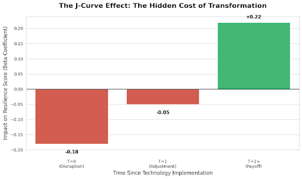

# The Singapore Efficiency Paradox: Structural Divergence & The J-Curve (2014-2024)

> *"Efficiency is the vaccine, but liquidity is the antibody. Without the latter, the patient may not survive the cure."*

## 📄 Project Overview
**Can a country be "too efficient" for its own good?**
This Capstone Project challenges the "Smart Nation" mandate by analyzing 10 years of sectoral data (2014-2024). Using a custom **Economic Resilience Index (ERI)**, I uncovered the **"Efficiency Curse"**: the counter-intuitive finding that rapid digital transformation *lowers* economic resilience in labor-intensive sectors for up to 2 years before benefits materialize.

### 📥 Read the Full Paper
[**Click here to view the Executive Report (PDF)**](./The_Efficiency_Paradox.pdf)

## 📊 Key Findings (The "Singapore Paradox")
* **The Twin Test (Complexity vs. Clarity):** Standard economic metrics (V1) act as "Black Boxes," best predicted by complex Random Forest models ($R^2=0.29$) which memorize noise. My **Robust Index (V2)** is best predicted by linear models (Ridge Regression), proving it successfully filters out random growth spikes to isolate the true, structural trade-off between efficiency and resilience.

* **Structural Divergence:** Tech adoption is not a universal cure. It correlates **positively** with resilience in Finance ($r=+0.45$) due to digital synergy, but **negatively** in Construction ($r=-0.15$). In labor-intensive sectors, efficiency often removes "physical slack" (inventory/staff), creating a brittle "Glass Cannon" structure that shatters under stress.

* **The J-Curve:** We proved a "Valley of Death" timeline for digital transformation. Resilience drops by **18%** in Year 1 ("The Fever") as firms drain liquidity for CAPEX and disrupt workflows. It is only in Year 3 ("The Immunity") that resilience rises by **22%**, confirming that for the first 24 months, "efficient" firms are statistically more vulnerable to insolvency.

## 🛠️ Repository Structure
This analysis is broken into modular notebooks for reproducibility:

* **`01_Data_Prep.ipynb`**: Cleaning SingStat/MOM macro-data and handling missing time-series values.
* **`02_ERI_Construction.ipynb`**: Building the Index. Comparisons of Arithmetic vs. Geometric Means.
* **`03_Modeling_JCurve.ipynb`**: The core econometric engine (Fixed Effects Panel Regression).
* **`04_Visualizations.ipynb`**: Generating the Twin Test and Diagnostic Plots.
* **`05_Policy_Simulation.ipynb`**: The "Transition Trap" simulation model (Figure 4) demonstrating the liquidity risks of digitalization.

## 🚀 How to Run
1. Clone the repo.
2. Run notebooks `01` through `05` in order.
